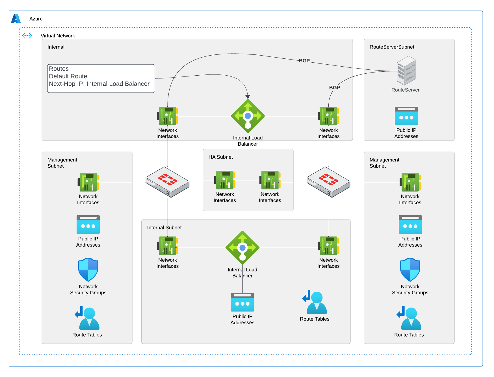

# Fortinet ARM Templates

:cloud: - [Introduction](#introduction) - [Design](#design) - [Deployment](#deployment) - [Requirements](#requirements-and-limitations) - [Configuration](#configuration) - :cloud:

## Introduction

This template is for a Active Passive HA Pair of Fortigates with External Load Balancer and Route Server

## Design

This deployment will deploy a pair of HA Fortigates in Active/Passive mode to a VNET. Five total subnets are required External, Internal, HA, Manaagement, and RouteServerSubnet. Four nics are deployed for the fortigate in the first four subnets.  The external and managment subnets will have Standard Static Public IPs attached to the management interfaces and External Load Balancer. NSGs will be applied to these interfaces to allow for access to the public IPs. A single Route Server is deployed with a public IP address and BGP connection to the internal Fortigate NICs.  Route Tables are deployed to the External and Management Subnets to override system created routes from the Route Server.  BGP will automatically be established between the route server and the Fortigates.

The Azure ARM Template will deploy the following resources:

- 1 Virtual Network with 5 Subnets
- 2 Fortigate Firewall with 4 NICs
- 1 Internal Load Balancer
- 1 External Load Balancer
- 1 Azure Route Server
- 4 Public IP Addresses
- 1 Network Security Group
- 1 Route Tables

This template can be utlized for deployement in an existing VNET, Availability Set, Availability Zones, or Route Server.

## Deployment

### Azure Portal

Standard Custom Template Deployment:

## Requirements-and-limitations

## Configuration
